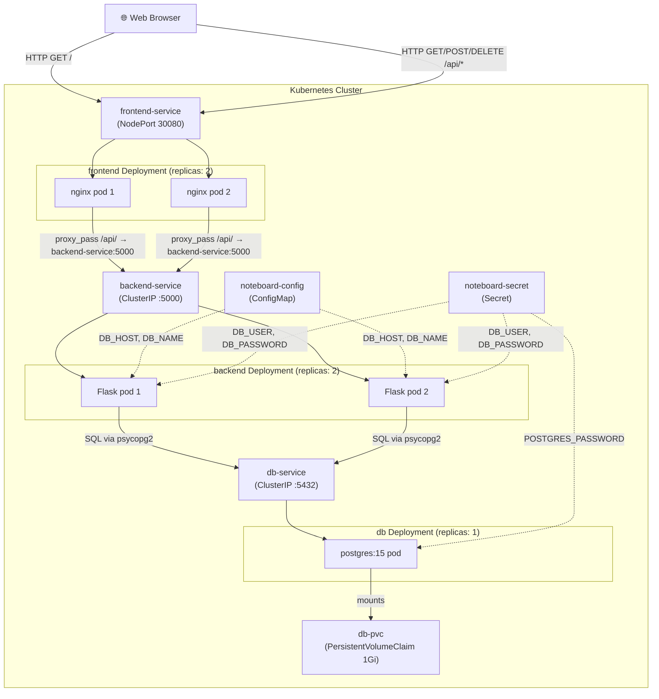

# Noteboard — Software Architecture

## System Diagram

## Component Roles and Responsibilities

### frontend (nginx:alpine)
Serves the single-page HTML/JS application to the browser. Also acts as a reverse proxy: any request matching `/api/*` is forwarded to `backend-service:5000` via Kubernetes internal DNS. The browser never needs to know the backend's address — it always talks to the same origin. This is the only component exposed externally (via NodePort).

### backend (Flask + psycopg2)
Stateless REST API with four endpoints:
- `GET /api/health` — liveness/readiness probe target
- `GET /api/notes` — returns all notes as JSON, newest first
- `POST /api/notes` — creates a note, returns the new record
- `DELETE /api/notes/<id>` — deletes a note by id

Connects to PostgreSQL using credentials injected from the ConfigMap and Secret. Initialises the `notes` table on startup if it does not exist (`CREATE TABLE IF NOT EXISTS`).

### db (postgres:15-alpine)
Single-replica PostgreSQL instance. Stores one table: `notes (id, text, created_at)`. Data is persisted to the `db-pvc` PersistentVolumeClaim so it survives pod deletion and rescheduling.

### ConfigMap (`noteboard-config`)
Holds non-sensitive configuration: `DB_HOST=db-service` and `DB_NAME=noteboard`. Injected as environment variables into backend pods.

### Secret (`noteboard-secret`)
Holds base64-encoded credentials: `DB_USER`, `DB_PASSWORD`, and `POSTGRES_PASSWORD`. Injected into both backend pods (for the Flask connection) and the db pod (for PostgreSQL initialisation).

## Inter-Service Communication

All communication inside the cluster uses **Kubernetes internal DNS** — service names resolve automatically within the cluster's default namespace:

| From | To | Protocol | Address |
|---|---|---|---|
| Browser | frontend-service | HTTP | NodePort 30080 (via minikube tunnel) |
| nginx (frontend pod) | backend-service | HTTP | `http://backend-service:5000` |
| Flask (backend pod) | db-service | TCP/PostgreSQL | `db-service:5432` |

The nginx `proxy_pass` directive in `nginx.conf` is the mechanism that makes the frontend call the backend's REST API — satisfying the requirement for inter-service REST communication.

## Cloud Architecture Patterns Applied

| Pattern | Where applied |
|---|---|
| **API Gateway / Reverse Proxy** | nginx frontend proxies all `/api/` calls to the backend, acting as a single entry point. The browser only talks to one address. |
| **Database-per-service** | PostgreSQL is a dedicated pod used only by the backend — not shared with any other service. |
| **Stateless compute** | Both frontend and backend pods carry no in-process state. All persistent state lives in PostgreSQL. This is what makes horizontal scaling safe — any replica can handle any request. |
| **Horizontal Scaling (Auto-Scaling Pattern)** | Frontend and backend are each in separate Deployments with `replicas: 2`, independently scalable via `kubectl scale`. |
| **Health Endpoint** | `GET /api/health` is a dedicated health endpoint used by Kubernetes readiness and liveness probes to manage pod lifecycle automatically. |
| **Infrastructure as Code** | Every resource — deployments, services, config, secrets, storage — is declared in version-controlled YAML. The entire system deploys with one command: `kubectl apply -f k8s/`. |

## Component → Image → Kubernetes Resource Mapping

| Software Component | Microservice Name | Docker Image | Kubernetes Resources |
|---|---|---|---|
| Static HTML/JS + nginx proxy | frontend | `jovnx79/noteboard-frontend:v1` | Deployment `frontend`, Service `frontend-service` (NodePort) |
| Flask REST API | backend | `jovnx79/noteboard-backend:v1` | Deployment `backend`, Service `backend-service` (ClusterIP) |
| PostgreSQL 15 | db | `postgres:15-alpine` (official) | Deployment `db`, Service `db-service` (ClusterIP), PVC `db-pvc` |
| Configuration | — | — | ConfigMap `noteboard-config` |
| Credentials | — | — | Secret `noteboard-secret` |
